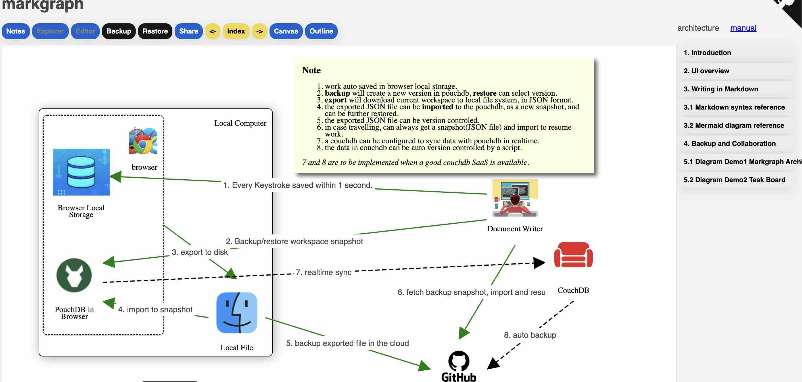
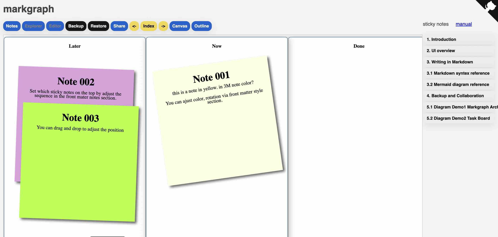
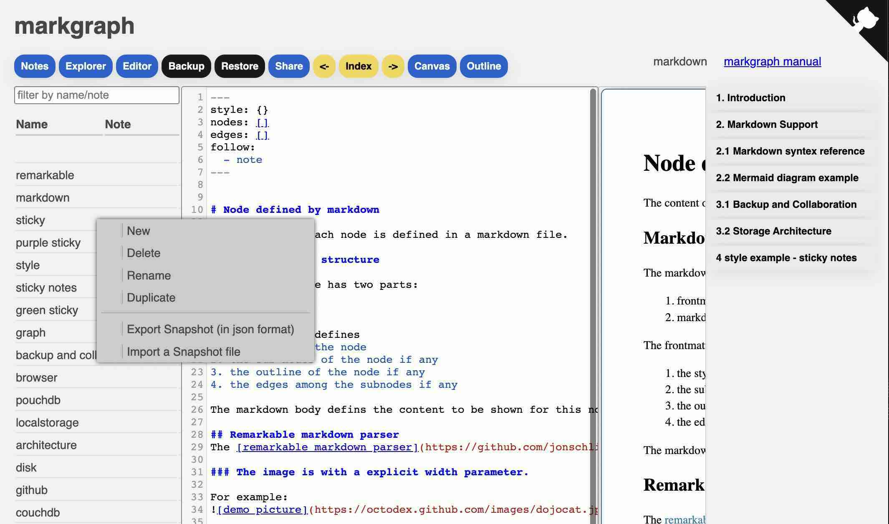
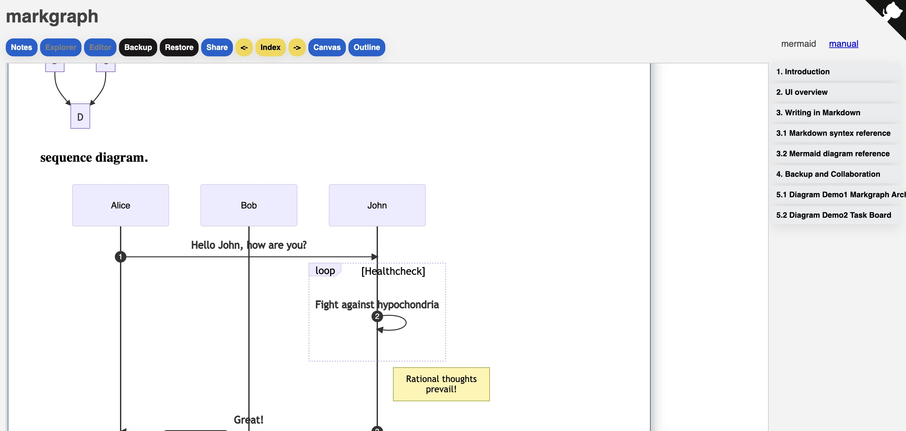
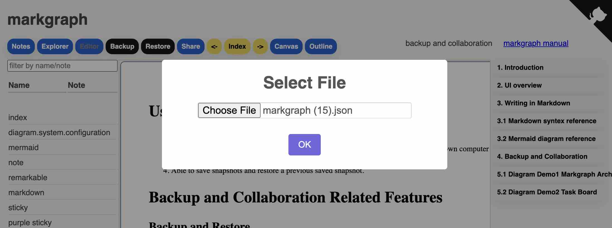
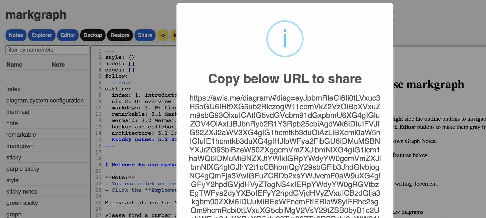

# Markgraph

Markgraph stands for Markdown Graph Notes.

[Live Demo is avalable here!](http://awis.me/diagram/)

Please find a number of key features below:

- Markdown
	- Markdown for writing document.
- Graph
	- Mermaid to draw diagrams
	- Connect nodes to draw complex diagrams.
    
    Each document is a node, one node can have a number of sub nodes. The subnodes can be connected via arrows in different color, style etc.
- Notes
	- There is no server needed. The app is a single page app running in your browser.
    - Every keystroke will be saved within one second.
    - Git like time machine to keep changes saved as snapshots, you can always go back to a previous snapshot.
	- Easy to import and export via a single text file.
	- Easy to share the document via an URL.
    
## Terms used in markgraph

Workspace
:  All the document you can access in markgraph UI. In the workspace, there is at least one Notes.

Notes
:  A collection of document. There maybe several notes in the workspace. You can switch by selecting in the explorer. 

Node
:  A node is a document. It can have sub nodes ( sub documents) too.

Snapshot
:  A copy of the workspace.

Explorer
:  A list view to show notes in current workspace, or nodes under current notes.

Editor
:  An area for editing node. 

Canvas
:  The area to show the preview version of the node.

Outline
:  Showing a list of nodes, click on one item will jump to that node.

## User's Manual

[The Manual itself is created using markgraph, and it is available online.](http://awis.me/diagram/) 

Please find below some screen capture of the manual.

